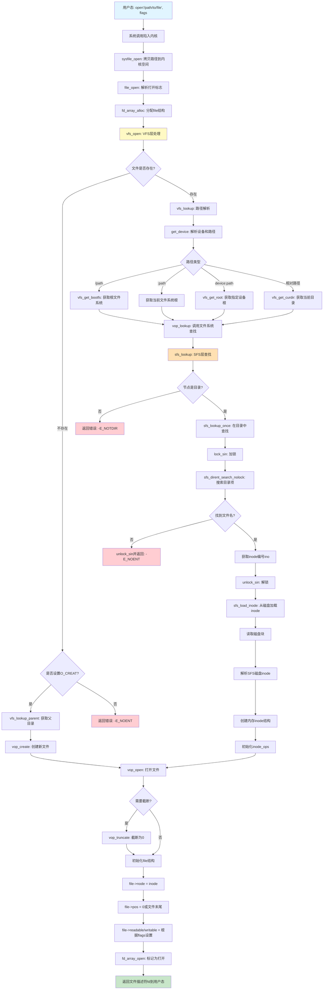

# open系统调用的数据流和控制流分析

## 一、整体概述

open系统调用经历了三个主要层次：
1. **通用文件访问接口层**（系统调用处理）
2. **文件系统抽象层**（VFS层）
3. **具体文件系统层**（SFS层）

## 二、数据流和控制流详细分析

### 1. 用户态到内核态：系统调用入口

```c
// 用户态程序调用
int fd = open("/path/to/file", O_RDWR);

// ↓ 系统调用陷入内核

// kern/syscall/syscall.c
// 系统调用分发，根据调用号跳转到对应的内核函数
// 进入 sysfile_open()
```

**数据流**：
- 输入：用户态字符串指针 `__path`，打开标志 `open_flags`
- 输出：文件描述符 `fd` (成功) 或错误码 (失败)

---

### 2. 通用文件访问接口层：sysfile_open()

```c
// kern/fs/sysfile.c
int sysfile_open(const char *__path, uint32_t open_flags) {
    int ret;
    char *path;
    
    // [数据流] 从用户空间拷贝路径字符串到内核空间
    // 防止用户态传入非法指针，保证内核安全性
    if ((ret = copy_path(&path, __path)) != 0) {
        return ret;  // 拷贝失败，返回错误码
    }
    
    // [控制流] 调用文件系统抽象层接口
    ret = file_open(path, open_flags);
    
    // [资源管理] 释放内核空间的路径字符串
    kfree(path);
    
    return ret;  // 返回文件描述符或错误码
}
```

**关键点**：
- 用户空间 → 内核空间的数据拷贝（安全边界）
- 内存管理：动态分配和释放

---

### 3. 文件系统抽象层（VFS）：file_open()

```c
// kern/fs/file.c
int file_open(char *path, uint32_t open_flags) {
    bool readable = 0, writable = 0;
    
    // [控制流] 解析打开模式标志
    switch (open_flags & O_ACCMODE) {
    case O_RDONLY: readable = 1; break;      // 只读
    case O_WRONLY: writable = 1; break;      // 只写
    case O_RDWR:   readable = writable = 1; break;  // 读写
    default: return -E_INVAL;  // 非法标志
    }
    
    int ret;
    struct file *file;
    
    // [数据流] 在当前进程的文件描述符表中分配一个空闲项
    // current->fs_struct->filemap[] 中找到空闲的file结构
    if ((ret = fd_array_alloc(NO_FD, &file)) != 0) {
        return ret;  // 分配失败（如打开文件数达到上限）
    }
    
    struct inode *node;
    
    // [控制流] 调用VFS层的vfs_open，查找或创建inode
    // 这是核心步骤：路径名 → inode的转换
    if ((ret = vfs_open(path, open_flags, &node)) != 0) {
        fd_array_free(file);  // 失败则释放之前分配的file
        return ret;
    }
    
    // [数据流] 初始化file结构体
    file->pos = 0;  // 文件读写位置初始化为0
    
    // [控制流] 如果是追加模式，需要获取文件大小
    if (open_flags & O_APPEND) {
        struct stat __stat, *stat = &__stat;
        // 获取文件元数据
        if ((ret = vop_fstat(node, stat)) != 0) {
            vfs_close(node);
            fd_array_free(file);
            return ret;
        }
        file->pos = stat->st_size;  // 设置到文件末尾
    }
    
    // [数据流] 建立file和inode的关联
    file->node = node;
    file->readable = readable;
    file->writable = writable;
    
    // [状态管理] 标记文件为"已打开"状态
    fd_array_open(file);
    
    // [数据流] 返回文件描述符（在filemap[]中的索引）
    return file->fd;
}
```

**关键数据结构**：
- `struct file`：进程级的文件描述符，记录文件位置、读写权限
- `struct inode`：文件系统级的索引节点，文件元数据

---

### 4. VFS层核心：vfs_open()

```c
// kern/fs/vfs/vfsfile.c
int vfs_open(char *path, uint32_t open_flags, struct inode **node_store) {
    bool can_write = 0;
    
    // [控制流] 权限检查：解析访问模式
    switch (open_flags & O_ACCMODE) {
    case O_RDONLY: break;
    case O_WRONLY:
    case O_RDWR:
        can_write = 1;
        break;
    default:
        return -E_INVAL;
    }

    // [控制流] O_TRUNC标志检查（截断文件需要写权限）
    if (open_flags & O_TRUNC) {
        if (!can_write) {
            return -E_INVAL;
        }
    }

    int ret; 
    struct inode *node;
    bool excl = (open_flags & O_EXCL) != 0;    // 排他创建
    bool create = (open_flags & O_CREAT) != 0; // 不存在则创建
    
    // [控制流核心] 路径名查找：path → inode
    ret = vfs_lookup(path, &node);

    // [控制流分支1] 文件不存在的情况
    if (ret != 0) {
        if (ret == -16 && (create)) {  // -16 = 文件不存在
            // 需要创建新文件
            char *name;
            struct inode *dir;
            
            // [数据流] 获取父目录的inode和文件名
            if ((ret = vfs_lookup_parent(path, &dir, &name)) != 0) {
                return ret;  // 父目录不存在，无法创建
            }
            
            // [控制流] 在父目录中创建新文件
            ret = vop_create(dir, name, excl, &node);
        } else {
            return ret;  // 其他错误或不需要创建
        }
    } 
    // [控制流分支2] 文件已存在但要求排他创建
    else if (excl && create) {
        return -E_EXISTS;  // O_EXCL | O_CREAT 时文件存在则失败
    }
    
    assert(node != NULL);

    // [控制流] 调用文件系统特定的打开操作
    // 对于设备文件，这里会执行特定的初始化
    if ((ret = vop_open(node, open_flags)) != 0) { 
        vop_ref_dec(node);  // 打开失败，减少引用计数
        return ret;
    }

    // [数据流] inode引用计数管理
    vop_open_inc(node);  // 增加打开计数
    
    // [控制流] 如果需要截断文件或是新创建的文件
    if (open_flags & O_TRUNC || create) {
        if ((ret = vop_truncate(node, 0)) != 0) {
            vop_open_dec(node);
            vop_ref_dec(node);
            return ret;
        }
    }
    
    // [数据流输出] 将找到的inode返回给调用者
    *node_store = node;
    return 0;
}
```

**关键操作**：
- `vfs_lookup()`：路径名解析的核心
- `vop_create()`：创建新文件
- `vop_open()`：文件系统特定的打开操作
- 引用计数管理：防止inode被过早释放

---

### 5. VFS层：路径名解析 vfs_lookup()

```c
// kern/fs/vfs/vfsfile.c
int vfs_lookup(char *path, struct inode **node_store) {
    int ret;
    struct inode *node;
    
    // [控制流] 第一步：解析设备名，获取起始inode
    // 处理三种路径格式：
    //   1. "/path"  - 从根文件系统开始（bootfs）
    //   2. ":path"  - 从当前文件系统根开始
    //   3. "device:/path" - 从指定设备的根开始
    //   4. "path"   - 相对路径，从当前目录开始
    if ((ret = get_device(path, &path, &node)) != 0) {
        return ret;
    }
    
    // [控制流] 第二步：如果还有剩余路径，继续查找
    if (*path != '\0') {
        // [数据流] 调用inode的lookup操作（多态调用）
        // 对于目录inode，会在目录中查找下一级
        ret = vop_lookup(node, path, node_store);
        vop_ref_dec(node);  // 释放起始inode
        return ret;
    }
    
    // [控制流] 路径为空，说明要打开的就是起始节点（如根目录）
    *node_store = node;
    return 0;
}
```

**get_device() 函数分析**：

```c
// kern/fs/vfs/vfsfile.c
static int get_device(char *path, char **subpath, struct inode **node_store) {
    int i, slash = -1, colon = -1;
    
    // [控制流] 扫描路径，找到第一个':'或'/'
    for (i = 0; path[i] != '\0'; i++) {
        if (path[i] == ':') { colon = i; break; }
        if (path[i] == '/') { slash = i; break; }
    }
    
    // [控制流分支1] 相对路径（无':'且不以'/'开头）
    if (colon < 0 && slash != 0) {
        *subpath = path;
        // [数据流] 返回当前目录的inode
        return vfs_get_curdir(node_store);
    }
    
    // [控制流分支2] 设备路径 "device:path"
    if (colon > 0) {
        path[colon] = '\0';  // 截断，提取设备名
        while (path[++colon] == '/');  // 跳过'/'
        *subpath = path + colon;
        // [数据流] 获取指定设备的根inode
        return vfs_get_root(path, node_store);
    }

    // [控制流分支3] 绝对路径 "/path"
    int ret;
    if (*path == '/') {
        // [数据流] 获取启动文件系统（bootfs）的根inode
        if ((ret = vfs_get_bootfs(node_store)) != 0) {
            return ret;
        }
    }
    // [控制流分支4] 当前文件系统路径 ":path"
    else {
        assert(*path == ':');
        struct inode *node;
        if ((ret = vfs_get_curdir(&node)) != 0) {
            return ret;
        }
        assert(node->in_fs != NULL);
        // [数据流] 获取当前文件系统的根inode
        *node_store = fsop_get_root(node->in_fs);
        vop_ref_dec(node);
    }

    while (*(++path) == '/');  // 跳过开头的多个'/'
    *subpath = path;
    return 0;
}
```

---

### 6. SFS文件系统层：sfs_lookup()

```c
// kern/fs/sfs/sfs_inode.c
static int sfs_lookup(struct inode *node, char *path, struct inode **node_store) {
    // [数据流] 获取SFS文件系统结构
    struct sfs_fs *sfs = fsop_info(vop_fs(node), sfs);
    
    // [控制流] 路径检查（简化版，不支持多级目录）
    assert(*path != '\0' && *path != '/');
    
    vop_ref_inc(node);  // 增加引用计数
    
    // [数据流] 获取SFS特定的inode信息
    struct sfs_inode *sin = vop_info(node, sfs_inode);
    
    // [控制流] 类型检查：必须是目录类型
    if (sin->din->type != SFS_TYPE_DIR) {
        vop_ref_dec(node);
        return -E_NOTDIR;  // 不是目录，无法查找
    }
    
    struct inode *subnode;
    
    // [控制流核心] 在目录中查找指定名称的文件
    int ret = sfs_lookup_once(sfs, sin, path, &subnode, NULL);

    vop_ref_dec(node);  // 释放父目录inode
    
    if (ret != 0) {
        return ret;
    }
    
    // [数据流输出] 返回找到的inode
    *node_store = subnode;
    return 0;
}
```

---

### 7. SFS文件系统层：sfs_lookup_once()

```c
// kern/fs/sfs/sfs_inode.c
static int sfs_lookup_once(struct sfs_fs *sfs, struct sfs_inode *sin, 
                           const char *name, struct inode **node_store, int *slot) {
    int ret;
    uint32_t ino;  // inode编号（磁盘块号）
    
    // [同步控制] 加锁保护目录操作
    lock_sin(sin);
    {   
        // [控制流] 在目录项中搜索文件名
        // [数据流] 输入：文件名name，输出：inode编号ino，槽位slot
        ret = sfs_dirent_search_nolock(sfs, sin, name, &ino, slot, NULL);
    }
    unlock_sin(sin);  // 释放锁
    
    // [控制流] 找到目录项
    if (ret == 0) {
        // [数据流] 根据inode编号从磁盘加载inode内容
        // 1. 读取磁盘块（ino指示的块号）
        // 2. 解析SFS磁盘inode格式
        // 3. 创建内存中的inode结构
        ret = sfs_load_inode(sfs, node_store, ino);
    }
    
    return ret;
}
```

**sfs_dirent_search_nolock() 的工作**：
```c
// 伪代码说明
// 遍历目录的所有目录项（directory entry）
for (每个目录项 entry in 目录) {
    if (strcmp(entry.name, name) == 0) {
        *ino = entry.ino;      // 找到，返回inode编号
        *slot = entry_index;   // 返回槽位索引
        return 0;
    }
}
return -E_NOENT;  // 未找到
```

**sfs_load_inode() 的工作**：
```c
// 伪代码说明
1. 分配内存中的inode结构
2. 从磁盘读取inode数据块（根据ino）
3. 解析SFS磁盘inode格式填充内存inode
4. 初始化inode操作函数表（inode_ops）
5. 将inode加入到inode缓存中
6. 返回inode指针
```

---

## 三、数据结构关系图

```
进程                          文件系统
+------------------+         +-------------------+
| struct proc      |         | struct inode      |
|  +------------+  |         |  +--------------+ |
|  | fs_struct  |  |         |  | inode_ops    | |
|  |  filemap[] |--+--+      |  | (vop_open,   | |
|  +------------+  |  |      |  |  vop_lookup) | |
+------------------+  |      |  +--------------+ |
                      |      |                   |
                      |      | in_type           |
                      v      | in_fs  -----------+--> struct fs (文件系统)
            +---------------+|                   |
            | struct file   ||in_info            |
            | +----------+  ||                   |
            | | node     |--+|                   |
            | | pos      |  +-------------------+
            | | readable |           |
            | | writable |           v
            | +----------+  +-------------------+
            +---------------| struct sfs_inode  |
                            | +---------------+ |
                            | | sfs_disk_inode| |
                            | | (din)         | |
                            | | - type        | |
                            | | - blocks      | |
                            | | - size        | |
                            | +---------------+ |
                            +-------------------+
```

---

## 四、完整的控制流程图

```
用户态
  |
  | open("/path/to/file", flags)
  |
  v
[系统调用陷入]
  |
  v
+----------------------------------------------------------+
| 通用文件访问接口层 (kern/fs/sysfile.c)                    |
+----------------------------------------------------------+
| sysfile_open(__path, open_flags)                         |
|   1. copy_path(): 用户空间 → 内核空间                     |
|   2. file_open(path, open_flags)                         |
|   3. kfree(path): 释放内核缓冲区                          |
+----------------------------------------------------------+
  |
  v
+----------------------------------------------------------+
| 文件系统抽象层 - file层 (kern/fs/file.c)                  |
+----------------------------------------------------------+
| file_open(path, open_flags)                              |
|   1. 解析打开模式 (O_RDONLY/O_WRONLY/O_RDWR)             |
|   2. fd_array_alloc(): 分配file结构                      |
|   3. vfs_open(path, open_flags, &node)  ----------------+
|   4. 初始化file结构（pos, readable, writable）            |
|   5. fd_array_open(): 标记为已打开                       |
|   6. 返回文件描述符fd                                     |
+----------------------------------------------------------+
                                                           |
  +--------------------------------------------------------+
  |
  v
+----------------------------------------------------------+
| 文件系统抽象层 - VFS层 (kern/fs/vfs/vfsfile.c)            |
+----------------------------------------------------------+
| vfs_open(path, open_flags, &node)                        |
|   1. 权限检查（O_TRUNC需要写权限）                        |
|   2. vfs_lookup(path, &node)  --------------------------+
|   3. 如果文件不存在且O_CREAT:                            |
|      - vfs_lookup_parent(): 获取父目录                   |
|      - vop_create(): 创建新文件                          |
|   4. vop_open(node, open_flags): 文件系统特定打开        |
|   5. 如果O_TRUNC: vop_truncate(node, 0)                  |
|   6. 返回inode                                           |
+----------------------------------------------------------+
                                                           |
  +--------------------------------------------------------+
  |
  v
+----------------------------------------------------------+
| VFS层 - 路径解析 (kern/fs/vfs/vfsfile.c)                 |
+----------------------------------------------------------+
| vfs_lookup(path, &node)                                  |
|   1. get_device(path, &path, &node)                     |
|      - 处理相对路径 → vfs_get_curdir()                   |
|      - 处理绝对路径"/" → vfs_get_bootfs()                |
|      - 处理设备路径"dev:" → vfs_get_root()               |
|   2. 如果有剩余路径:                                      |
|      vop_lookup(node, path, &node) --------------------+
|   3. 返回inode                                           |
+----------------------------------------------------------+
                                                           |
  +--------------------------------------------------------+
  |
  v
+----------------------------------------------------------+
| SFS文件系统层 (kern/fs/sfs/sfs_inode.c)                  |
+----------------------------------------------------------+
| sfs_lookup(node, path, &node_store)                      |
|   [通过inode_ops的vop_lookup函数指针调用]                |
|   1. 检查node是否为目录类型                               |
|   2. sfs_lookup_once(sfs, sin, path, &subnode) --------+
|   3. 返回找到的inode                                     |
+----------------------------------------------------------+
                                                           |
  +--------------------------------------------------------+
  |
  v
+----------------------------------------------------------+
| SFS文件系统层 - 目录查找                                  |
+----------------------------------------------------------+
| sfs_lookup_once(sfs, sin, name, &node, &slot)           |
|   1. lock_sin(): 加锁                                    |
|   2. sfs_dirent_search_nolock():                        |
|      - 遍历目录项                                        |
|      - 匹配文件名                                        |
|      - 返回inode编号(ino)和槽位(slot)                    |
|   3. unlock_sin(): 解锁                                  |
|   4. sfs_load_inode(sfs, &node, ino):                   |
|      - 从磁盘读取inode数据                               |
|      - 创建内存inode结构                                 |
|      - 初始化inode_ops函数表                             |
|   5. 返回inode                                           |
+----------------------------------------------------------+
  |
  v
+----------------------------------------------------------+
| 磁盘I/O层                                                |
+----------------------------------------------------------+
| - 读取目录数据块（查找目录项）                            |
| - 读取inode数据块（加载inode）                           |
| - 通过IDE/DISK设备驱动完成实际I/O                        |
+----------------------------------------------------------+
```

---

## 五、数据流总结

```
用户态字符串 "/path/to/file"
    |
    | [copy_path]
    v
内核态字符串 (临时缓冲区)
    |
    | [vfs_lookup路径解析]
    v
inode编号 (ino) ──┐
                  |
                  | [sfs_load_inode]
                  v
         SFS磁盘inode (on disk)
                  |
                  | [读取并解析]
                  v
         SFS内存inode (in memory)
                  |
                  | [包装为VFS inode]
                  v
         struct inode *node
                  |
                  | [关联到file结构]
                  v
         struct file (在filemap[]中)
                  |
                  | [返回数组索引]
                  v
         文件描述符 fd (整数)
                  |
                  | [返回用户态]
                  v
         用户程序获得fd
```

---

## 六、关键点总结

### 1. 三层架构的职责分工

| 层次 | 主要职责 | 关键函数 |
|------|---------|---------|
| **通用文件访问接口层** | 系统调用处理、用户态↔内核态数据传递 | `sysfile_open`, `copy_path` |
| **VFS抽象层** | 路径解析、文件描述符管理、跨文件系统统一接口 | `file_open`, `vfs_open`, `vfs_lookup` |
| **SFS文件系统层** | 具体文件系统操作、磁盘I/O、目录项查找 | `sfs_lookup`, `sfs_lookup_once`, `sfs_load_inode` |

### 2. 核心数据转换链

```
路径字符串 → 设备+相对路径 → 父目录inode → 目录项搜索 → inode编号 → 磁盘inode → 内存inode → file结构 → fd
```

### 3. 函数调用链（自顶向下）

```
open() [用户态]
  → sysfile_open()
    → file_open()
      → vfs_open()
        → vfs_lookup()
          → get_device()
            → vfs_get_bootfs() / vfs_get_curdir()
          → vop_lookup()
            → sfs_lookup() [通过函数指针]
              → sfs_lookup_once()
                → sfs_dirent_search_nolock()
                → sfs_load_inode()
```

### 4. 错误处理的逐层回退

每一层在失败时都会：
1. 释放已分配的资源
2. 减少引用计数
3. 向上层返回错误码
4. 保证系统状态一致性

---

## 七、流程图（Mermaid格式）



---

## 八、实际执行示例

假设执行 `open("/sfs_filetest1", O_RDWR)`：

```
1. 用户态调用 open()
   → fd = ?

2. sysfile_open("/sfs_filetest1", O_RDWR)
   → copy_path: 拷贝路径到内核
   → 内核path = "/sfs_filetest1"

3. file_open("/sfs_filetest1", O_RDWR)
   → 解析flags: readable=1, writable=1
   → 分配file: file = current->filemap[3] (假设fd=3空闲)

4. vfs_open("/sfs_filetest1", O_RDWR, &node)
   → vfs_lookup("/sfs_filetest1", &node)
   
5. get_device("/sfs_filetest1", &path, &node)
   → 识别为绝对路径（以'/'开头）
   → vfs_get_bootfs(&node) → node = 根目录inode
   → path = "sfs_filetest1" (去掉'/')

6. vop_lookup(根目录inode, "sfs_filetest1", &node)
   → 调用sfs_lookup()

7. sfs_lookup(根目录inode, "sfs_filetest1", &node)
   → 检查：根目录是DIR类型 ✓
   → sfs_lookup_once(sfs, 根目录sin, "sfs_filetest1", &node)

8. sfs_lookup_once()
   → lock_sin(根目录)
   → sfs_dirent_search_nolock("sfs_filetest1")
     遍历根目录的目录项:
       entry[0]: name=".", ino=0
       entry[1]: name="..", ino=0
       entry[2]: name="sfs_filetest1", ino=5 ✓ 找到！
   → unlock_sin()
   → sfs_load_inode(sfs, &node, ino=5)
     - 读取磁盘块5
     - 解析inode: type=FILE, size=1024, blocks=...
     - 创建内存inode

9. 返回到vfs_open()
   → vop_open(node, O_RDWR): 执行sfs_open()
   → node->open_count++

10. 返回到file_open()
    → file->node = node
    → file->pos = 0
    → file->readable = 1
    → file->writable = 1
    → file->fd = 3

11. 返回到用户态
    → fd = 3

用户程序可以使用fd=3进行read/write操作
```

---

## 九、用户程序加载与终端执行

### 概述

这是ucore step by step tutorial的最后一节: 实现一个简单的终端(shell)。

我们的操作系统之旅，从内核初始化开始，最终在终端中与用户程序交互结束。

### 程序的执行

我们的终端需要实现这样的功能: 根据输入的程序名称, 从文件系统里加载对应的程序并执行。我们采取`fork() + exec()`的方式来加载执行程序，`exec()`的一系列接口都需要重写来使用文件系统。

### do_execve() 函数分析

#### 函数原型的变化

**以前的函数原型**（从内存的某个位置加载程序）：
```c
int do_execve(const char *name, size_t len, unsigned char *binary, size_t size);
```

**现在的函数原型**（从文件系统加载程序）：
```c
int do_execve(const char *name, int argc, const char **argv);
```

#### 函数功能说明

现在的`do_execve()`调用文件系统接口加载程序，首先为加载新的执行码做好用户态内存空间清空准备。如果mm不为NULL，则设置页表为内核空间页表，且进一步判断mm的引用计数减1后是否为0，如果为0，则表明没有进程再需要此进程所占用的内存空间，为此将根据mm中的记录，释放进程所占用户空间内存和进程页表本身所占空间。最后把当前进程的mm内存管理指针为空。

#### 详细代码注释

```c
// kern/process/proc.c
// do_execve - call exit_mmap(mm)&put_pgdir(mm) to reclaim memory space of current process
//           - call load_icode to setup new memory space accroding binary prog.
int
do_execve(const char *name, int argc, const char **argv) {
    // [编译时断言] 确保参数长度限制大于等于文件路径长度限制
    // 这样可以保证路径字符串不会超出参数缓冲区
    static_assert(EXEC_MAX_ARG_LEN >= FS_MAX_FPATH_LEN);
    
    // [数据流] 获取当前进程的内存管理结构
    struct mm_struct *mm = current->mm;
    
    // [控制流] 参数数量检查：至少1个（程序名），最多EXEC_MAX_ARG_NUM个
    if (!(argc >= 1 && argc <= EXEC_MAX_ARG_NUM)) {
        return -E_INVAL;  // 参数数量非法
    }

    // [数据结构] 局部缓冲区，用于存储进程名称
    char local_name[PROC_NAME_LEN + 1];
    memset(local_name, 0, sizeof(local_name));  // 初始化为0

    // [数据结构] 内核空间的参数数组
    // 用于存储从用户空间拷贝过来的参数指针
    char *kargv[EXEC_MAX_ARG_NUM];
    const char *path;  // 可执行文件路径

    int ret = -E_INVAL;  // 返回值，默认为无效参数错误

    // [同步控制] 锁定当前进程的内存管理结构
    // 防止其他线程在拷贝数据时修改内存布局
    lock_mm(mm);
    
    // [控制流] 处理进程名称
    if (name == NULL) {
        // 如果没有提供名称，使用默认格式：<null> PID
        snprintf(local_name, sizeof(local_name), "<null> %d", current->pid);
    }
    else {
        // [数据流] 从用户空间拷贝进程名称到内核空间
        if (!copy_string(mm, local_name, name, sizeof(local_name))) {
            unlock_mm(mm);  // 拷贝失败，解锁后返回
            return ret;
        }
    }
    
    // [数据流] 拷贝命令行参数数组
    // 将用户空间的argv[]拷贝到内核空间的kargv[]
    // 包括拷贝字符串内容本身
    if ((ret = copy_kargv(mm, argc, kargv, argv)) != 0) {
        unlock_mm(mm);  // 拷贝失败，解锁后返回
        return ret;
    }
    
    // [数据流] 第一个参数是可执行文件的路径
    path = argv[0];
    
    // [同步控制] 解锁内存管理结构
    // 后续操作不再需要访问旧的内存空间
    unlock_mm(mm);
    
    // [资源管理] 关闭当前进程所有打开的文件
    // 执行新程序时，通常需要清空文件描述符表
    // （某些文件描述符可能设置了FD_CLOEXEC标志，需要在exec时关闭）
    files_closeall(current->filesp);

    /* sysfile_open will check the first argument path, thus we have to use a user-space pointer, 
       and argv[0] may be incorrect */
    int fd;
    
    // [控制流] 打开可执行文件
    // [数据流] 从文件系统中打开路径指定的文件，以只读方式
    // 返回文件描述符fd，如果失败则返回负数错误码
    if ((ret = fd = sysfile_open(path, O_RDONLY)) < 0) {
        goto execve_exit;  // 打开失败，跳转到错误处理
    }
    
    // [控制流] 清空当前进程的用户态内存空间
    if (mm != NULL) {
        // [内存管理] 切换到内核页表（boot_cr3）
        // 这样后续操作就不会访问到即将被释放的用户空间
        lcr3(boot_cr3);
        
        // [引用计数] 减少mm的引用计数
        // 如果引用计数降为0，说明没有其他进程共享这个内存空间
        if (mm_count_dec(mm) == 0) {
            // [内存管理] 释放所有用户空间的虚拟内存区域
            // 包括代码段、数据段、堆、栈等
            exit_mmap(mm);
            
            // [内存管理] 释放页目录表所占的物理页
            put_pgdir(mm);
            
            // [内存管理] 销毁mm_struct结构本身
            mm_destroy(mm);
        }
        
        // [状态更新] 当前进程不再有用户态内存空间
        // 准备加载新的程序
        current->mm = NULL;
    }
    
    // [错误处理] 设置默认错误码为内存不足
    ret = -E_NO_MEM;
    
    // [控制流核心] 加载可执行文件的内容到新的内存空间
    // [数据流] 从文件描述符fd读取ELF格式的可执行文件
    //         解析ELF头、程序头表，建立新的内存映射
    //         拷贝argc和kargv到新的用户栈
    if ((ret = load_icode(fd, argc, kargv)) != 0) {
        goto execve_exit;  // 加载失败，跳转到错误处理
    }
    
    // [资源管理] 释放内核空间的参数数组
    // load_icode已经将参数拷贝到用户栈，内核副本可以释放
    put_kargv(argc, kargv);
    
    // [状态更新] 设置进程的名称
    set_proc_name(current, local_name);
    
    // [控制流] 成功返回0
    // 此时进程的用户态内存空间已经完全替换为新程序
    // 当从内核态返回用户态时，将开始执行新程序的入口点
    return 0;

execve_exit:
    // [错误处理] 执行失败的清理工作
    
    // [资源管理] 释放内核空间的参数数组
    put_kargv(argc, kargv);
    
    // [控制流] 终止当前进程
    // 传入错误码，进程将退出
    do_exit(ret);
    
    // [防御性编程] 理论上do_exit不会返回，如果返回则说明出现严重错误
    panic("already exit: %e.\n", ret);
}
```


---

### 数据流图

```
用户态
  |
  | do_execve(name, argc, argv)
  v
+----------------------------------------------------------+
| 1. 参数拷贝阶段                                            |
+----------------------------------------------------------+
| - 用户空间name → 内核空间local_name (copy_string)         |
| - 用户空间argv[] → 内核空间kargv[] (copy_kargv)           |
+----------------------------------------------------------+
  |
  v
+----------------------------------------------------------+
| 2. 资源清理阶段                                            |
+----------------------------------------------------------+
| - files_closeall(): 关闭所有文件描述符                    |
| - 检查mm引用计数                                          |
|   - 如果为0: exit_mmap() → 释放所有VMA                   |
|            put_pgdir() → 释放页表                        |
|            mm_destroy() → 销毁mm_struct                  |
| - current->mm = NULL                                     |
+----------------------------------------------------------+
  |
  v
+----------------------------------------------------------+
| 3. 文件打开阶段                                            |
+----------------------------------------------------------+
| - sysfile_open(path, O_RDONLY)                          |
|   - 调用VFS层打开文件                                     |
|   - 返回文件描述符fd                                      |
+----------------------------------------------------------+
  |
  v
+----------------------------------------------------------+
| 4. 程序加载阶段 (load_icode)                              |
+----------------------------------------------------------+
| - 从fd读取ELF文件头                                       |
| - 解析ELF程序头表 (Program Headers)                       |
| - 为每个可加载段(PT_LOAD)创建VMA                          |
| - 从文件拷贝代码段、数据段到内存                           |
| - 创建用户栈 (USER_STACK)                                |
| - 将argc和argv拷贝到用户栈                                |
| - 设置trapframe:                                         |
|   - tf->epc = ELF入口点                                  |
|   - tf->sp = 用户栈指针                                   |
+----------------------------------------------------------+
  |
  v
+----------------------------------------------------------+
| 5. 收尾阶段                                               |
+----------------------------------------------------------+
| - put_kargv(): 释放内核参数数组                           |
| - set_proc_name(): 设置进程名称                           |
| - 返回0 (成功)                                            |
+----------------------------------------------------------+
  |
  v
返回用户态 → 开始执行新程序 (从ELF entry point开始)
```

---

### 关键数据结构

```c
// 进程的内存管理结构
struct mm_struct {
    list_entry_t mmap_list;        // VMA链表
    struct vma_struct *mmap_cache; // 最近访问的VMA缓存
    pde_t *pgdir;                  // 页目录表指针
    int map_count;                 // VMA数量
    void *sm_priv;                 // swap管理器私有数据
    int mm_count;                  // 引用计数
    lock_t mm_lock;                // 内存管理结构的锁
};

// 虚拟内存区域
struct vma_struct {
    struct mm_struct *vm_mm;  // 所属的mm_struct
    uintptr_t vm_start;       // VMA起始地址
    uintptr_t vm_end;         // VMA结束地址
    uint32_t vm_flags;        // VMA标志（读、写、执行权限）
    list_entry_t list_link;   // 链表节点
};
```

---

### 执行流程示例

假设在shell中执行命令 `hello arg1 arg2`：

```
1. shell进程调用fork()创建子进程
   → child_pid = fork()

2. 子进程调用execve()
   → execve("hello", 3, ["hello", "arg1", "arg2"])

3. do_execve()执行
   (a) 拷贝参数
       - local_name = "hello"
       - kargv[0] = "hello"
       - kargv[1] = "arg1"
       - kargv[2] = "arg2"
   
   (b) 关闭所有文件
       - 清空文件描述符表
   
   (c) 打开可执行文件
       - fd = sysfile_open("hello", O_RDONLY)
       - 从文件系统查找hello文件
       - 返回fd = 3
   
   (d) 清空旧的内存空间
       - 切换到内核页表
       - 释放代码段、数据段、堆、栈
       - 释放页表
       - current->mm = NULL
   
   (e) 加载新程序 load_icode(fd=3, argc=3, kargv)
       - 读取ELF头: e_entry = 0x100000 (入口地址)
       - 读取程序头表:
         * Segment 1: 代码段 [0x100000 - 0x103000], 权限: r-x
         * Segment 2: 数据段 [0x104000 - 0x105000], 权限: rw-
       - 创建VMA并映射:
         * VMA1: [0x100000, 0x103000), flags=VM_READ|VM_EXEC
         * VMA2: [0x104000, 0x105000), flags=VM_READ|VM_WRITE
       - 从文件拷贝内容到内存
       - 创建用户栈: VMA3 [USER_STACK - USER_STACK_SIZE, USER_STACK)
       - 在用户栈上构造参数:
         ```
         高地址
         +-----------------+
         |     NULL        |  ← argv[3]
         +-----------------+
         |   "arg2\0"      |  ← argv[2]指向这里
         +-----------------+
         |   "arg1\0"      |  ← argv[1]指向这里
         +-----------------+
         |   "hello\0"     |  ← argv[0]指向这里
         +-----------------+
         | argv[2] (指针)  |
         +-----------------+
         | argv[1] (指针)  |
         +-----------------+
         | argv[0] (指针)  |
         +-----------------+
         |      argc=3     |  ← sp指向这里
         +-----------------+
         低地址
         ```
       - 设置trapframe:
         * tf->epc = 0x100000 (新程序入口)
         * tf->sp = USER_STACK - ... (用户栈指针)
   
   (f) 清理和返回
       - 释放kargv
       - 设置进程名称为"hello"
       - 返回0

4. 从系统调用返回
   → 恢复trapframe
   → epc = 0x100000, sp = 用户栈
   → 开始执行hello程序的main()函数
   → main()读取argc=3和argv数组

5. hello程序执行完毕后调用exit()
   → 子进程终止
   → 父进程(shell)通过wait()回收
```

---

### 与fork()的对比

| 操作 | fork() | execve() |
|------|--------|----------|
| **内存空间** | 拷贝父进程的内存空间（COW） | 完全清空，加载新程序 |
| **页表** | 拷贝父进程的页表 | 释放旧页表，创建新页表 |
| **代码段** | 与父进程相同 | 加载新程序的代码段 |
| **数据段** | 拷贝父进程的数据 | 加载新程序的数据段 |
| **堆** | 拷贝父进程的堆 | 初始为空 |
| **栈** | 拷贝父进程的栈 | 创建新栈，放置argc/argv |
| **打开的文件** | 继承父进程的文件描述符 | 通常会关闭（除非设置FD_CLOEXEC） |
| **进程ID** | 分配新的PID | 保持原PID不变 |
| **父进程** | 继承fork()调用者的父进程 | 不变 |


---

## 十、load_icode() 函数详细分析

### 概述

接下来的一步是加载应用程序执行码到当前进程的新创建的用户态虚拟空间中。这里涉及到读ELF格式的文件，申请内存空间，建立用户态虚存空间，加载应用程序执行码等。**`load_icode()`函数完成了整个复杂的工作**。

### 函数原型

```c
static int load_icode(int fd, int argc, char **kargv)
```

### 主要功能

`load_icode()`函数的主要工作就是**给用户进程建立一个能够让用户进程正常运行的用户环境**。此函数完成了如下重要工作：

#### 1. 创建内存管理结构

调用`mm_create()`函数来申请进程的**内存管理数据结构mm**所需内存空间，并对mm进行初始化。

调用`setup_pgdir()`来申请一个**页目录表**所需的一个页大小的内存空间，并把描述ucore内核虚空间映射的内核页表（`boot_pgdir`所指）的内容拷贝到此新目录表中，最后让`mm->pgdir`指向此页目录表。这就是进程新的页目录表了，且能够正确映射内核虚空间。

#### 2. 解析ELF文件并建立VMA

根据应用程序文件的**文件描述符（fd）**通过调用`load_icode_read()`函数来加载和解析此**ELF格式的执行程序**。

调用`mm_map()`函数根据ELF格式的执行程序说明的各个段（代码段、数据段、BSS段等）的起始位置和大小建立对应的**vma结构**，并把vma插入到mm结构中，从而表明了用户进程的合法用户态虚拟地址空间。

#### 3. 分配物理内存并加载程序内容

调用根据执行程序各个段的大小**分配物理内存空间**，并根据执行程序各个段的起始位置确定虚拟地址，并在**页表中建立好物理地址和虚拟地址的映射关系**。

然后把执行程序各个段的内容**拷贝到相应的内核虚拟地址**中，至此应用程序执行码和数据已经根据编译时设定地址放置到虚拟内存中了。

#### 4. 建立用户栈

需要给用户进程设置**用户栈**，为此调用`mm_mmap()`函数建立用户栈的vma结构，明确用户栈的位置在用户虚空间的顶端，大小为**256个页**，即**1MB**，并分配一定数量的物理内存且建立好栈的虚地址↔物理地址映射关系。

#### 5. 更新页表和设置参数

至此，进程内的内存管理vma和mm数据结构已经建立完成，于是把`mm->pgdir`赋值到**cr3寄存器**中，即**更新了用户进程的虚拟内存空间**，设置`uargc`和`uargv`在用户栈中。

此时的`initproc`已经被代码和数据覆盖，成为了第一个用户进程，但此时这个用户进程的执行现场还没建立好。

#### 6. 设置中断帧

先清空进程的**中断帧**，再重新设置进程的中断帧，使得在执行中断返回指令"`iret`"后，能够让CPU转到**用户态特权级**，并回到用户态内存空间，使用用户态的代码段、数据段和堆栈，且能够**跳转到用户进程的第一条指令执行**，并确保在用户态能够响应中断。

---

### 与实验5的对比

**实验8和实验5中`load_icode()`函数代码最大不同的地方在于读取ELF文件的方式**：

| 实验 | ELF文件读取方式 | 说明 |
|------|----------------|------|
| **实验5** | 通过内存地址直接访问 | 获取ELF在内存中的位置，根据ELF的格式进行解析 |
| **实验8** | 通过文件系统接口读取 | 通过ELF文件的文件描述符调用`load_icode_read()`函数来进行解析程序 |

---

### load_icode_read() 辅助函数

`load_icode_read()`函数用于从文件系统中读取ELF文件内容，实现如下：

```c
// kern/process/proc.c
static int
load_icode_read(int fd, void *buf, size_t len, off_t offset) {
    int ret;
    
    // [控制流] 第一步：移动文件指针到指定偏移量
    // [数据流] 调用系统文件接口定位到文件的offset位置
    // 这类似于用户态的lseek()系统调用
    if ((ret = sysfile_seek(fd, offset, LSEEK_SET)) != 0) {
        return ret;  // 定位失败，返回错误码
    }
    
    // [控制流] 第二步：从当前位置读取指定长度的数据
    // [数据流] 从文件中读取len字节到buf缓冲区
    // 返回值是实际读取的字节数
    if ((ret = sysfile_read(fd, buf, len)) != len) {
        // [错误处理] 读取的长度不符合预期
        // 如果ret<0，说明读取出错，返回错误码
        // 如果ret>=0但不等于len，说明文件提前结束，返回-1
        return (ret < 0) ? ret : -1;
    }
    
    // [控制流] 读取成功
    return 0;
}
```

---

### load_icode_read() 函数详解

#### 函数参数

| 参数 | 类型 | 说明 |
|------|------|------|
| `fd` | `int` | 文件描述符，指向要读取的ELF文件 |
| `buf` | `void *` | 指向读取数据的缓冲区 |
| `len` | `size_t` | 要读取的数据长度（字节数） |
| `offset` | `off_t` | 文件中的偏移量（从文件开头计算） |

#### 执行流程

```
1. sysfile_seek(fd, offset, LSEEK_SET)
   ├─ [功能] 移动文件读写指针到指定位置
   ├─ [参数] fd: 文件描述符
   │         offset: 目标偏移量
   │         LSEEK_SET: 从文件开头计算偏移
   └─ [返回] 0: 成功, 非0: 错误码

2. sysfile_read(fd, buf, len)
   ├─ [功能] 从当前文件位置读取数据
   ├─ [参数] fd: 文件描述符
   │         buf: 目标缓冲区
   │         len: 期望读取的字节数
   └─ [返回] 实际读取的字节数（应该等于len）

3. 返回值检查
   ├─ ret == len → 成功，返回0
   ├─ ret < 0 → 读取错误，返回错误码ret
   └─ 0 <= ret < len → 数据不足，返回-1
```

---

### load_icode_read() 使用场景

在`load_icode()`中，`load_icode_read()`被多次调用以读取ELF文件的不同部分：

#### 1. 读取ELF文件头
```c
struct elfhdr elf;
// 从文件开头（offset=0）读取ELF头（sizeof(elf)字节）
if ((ret = load_icode_read(fd, &elf, sizeof(struct elfhdr), 0)) != 0) {
    goto bad_elf_cleanup;
}
```

**数据流**：
```
磁盘上的ELF文件 (offset 0)
    |
    | [sysfile_seek + sysfile_read]
    v
struct elfhdr elf (内存中)
    - e_magic: 魔数 (0x7F 'E' 'L' 'F')
    - e_entry: 程序入口地址
    - e_phoff: 程序头表偏移量
    - e_phnum: 程序头表项数
```

#### 2. 读取程序头表
```c
struct proghdr ph;
// 读取每个程序头表项
for (i = 0; i < elf.e_phnum; i++) {
    off_t phoff = elf.e_phoff + sizeof(struct proghdr) * i;
    if ((ret = load_icode_read(fd, &ph, sizeof(struct proghdr), phoff)) != 0) {
        goto bad_cleanup;
    }
    // 处理程序头表项...
}
```

**数据流**：
```
ELF文件中的程序头表
    |
    | [多次调用load_icode_read]
    v
struct proghdr ph (循环读取)
    - p_type: 段类型 (PT_LOAD, PT_DYNAMIC等)
    - p_va: 虚拟地址
    - p_memsz: 内存中的大小
    - p_filesz: 文件中的大小
    - p_flags: 权限标志 (读/写/执行)
```

#### 3. 读取程序段内容
```c
// 读取代码段/数据段的实际内容
if ((ret = load_icode_read(fd, page2kva(page) + off, size, 
                           from)) != 0) {
    goto bad_cleanup;
}
```

**数据流**：
```
ELF文件中的段数据 (offset = from)
    |
    | [load_icode_read]
    v
物理页的内核虚拟地址 (page2kva(page) + off)
    |
    | [页表映射]
    v
用户进程的虚拟地址空间 (p_va)
```

---

### load_icode() 完整工作流程

```
+----------------------------------------------------------+
| 1. 创建内存管理结构                                        |
+----------------------------------------------------------+
| - mm_create(): 创建mm_struct                             |
| - setup_pgdir(): 创建页目录表，拷贝内核映射               |
| - mm->pgdir = 新页目录表                                  |
+----------------------------------------------------------+
  |
  v
+----------------------------------------------------------+
| 2. 读取和解析ELF文件                                      |
+----------------------------------------------------------+
| - load_icode_read(fd, &elf, sizeof(elf), 0)             |
|   → 读取ELF文件头                                         |
| - 检查魔数: elf.e_magic == ELF_MAGIC                     |
| - 获取程序头表信息: e_phoff, e_phnum                      |
+----------------------------------------------------------+
  |
  v
+----------------------------------------------------------+
| 3. 遍历程序头表，处理PT_LOAD段                            |
+----------------------------------------------------------+
| for each program header:                                |
|   - load_icode_read(fd, &ph, ...)                       |
|     → 读取程序头表项                                      |
|   - if (ph.p_type == PT_LOAD):                          |
|     (a) mm_map(): 创建VMA                               |
|         - 虚拟地址: ph.p_va ~ ph.p_va + ph.p_memsz     |
|         - 权限: 根据ph.p_flags设置                      |
|     (b) 分配物理页并建立映射:                            |
|         - pgdir_alloc_page(): 分配物理页                |
|         - 建立 虚拟地址 → 物理地址 的映射               |
|     (c) load_icode_read(): 从文件读取段内容             |
|         - 拷贝到物理页 (通过page2kva)                   |
|     (d) 清零BSS区域:                                     |
|         - memset(va + p_filesz, 0, p_memsz - p_filesz) |
+----------------------------------------------------------+
  |
  v
+----------------------------------------------------------+
| 4. 创建用户栈                                             |
+----------------------------------------------------------+
| - mm_mmap(): 创建用户栈的VMA                             |
|   - 地址: [USTACKTOP - USTACKSIZE, USTACKTOP)           |
|   - 大小: 256页 (1MB)                                    |
|   - 权限: VM_READ | VM_WRITE                             |
| - 分配栈的物理页                                          |
+----------------------------------------------------------+
  |
  v
+----------------------------------------------------------+
| 5. 构造用户栈内容（argc/argv）                            |
+----------------------------------------------------------+
| - 计算参数字符串所需空间                                   |
| - 在用户栈上布局:                                         |
|   [高地址]                                               |
|     NULL (argv终止符)                                    |
|     "arg2\0" (字符串)                                    |
|     "arg1\0"                                             |
|     "arg0\0"                                             |
|     argv[2] (指针)                                       |
|     argv[1]                                              |
|     argv[0]                                              |
|     argc (整数)                                          |
|   [低地址] ← uargv (栈指针)                              |
+----------------------------------------------------------+
  |
  v
+----------------------------------------------------------+
| 6. 更新页表和设置trapframe                                |
+----------------------------------------------------------+
| - lcr3(mm->pgdir): 切换到新的用户页表                     |
| - current->mm = mm: 关联mm到进程                         |
| - 清空trapframe                                          |
| - 设置trapframe:                                         |
|   - tf->status = SSTATUS_SPP(0) | SSTATUS_SPIE          |
|     (设置为用户态，启用中断)                              |
|   - tf->epc = elf.e_entry (程序入口地址)                 |
|   - tf->gpr.sp = USTACKTOP (用户栈顶)                    |
+----------------------------------------------------------+
  |
  v
[返回到do_execve] → [返回用户态] → [开始执行新程序]
```

---

### 关键技术点

#### 1. ELF文件格式解析

```
ELF文件结构:
+--------------------+
| ELF Header         | ← offset 0
| - e_magic          |   (魔数验证)
| - e_entry          |   (入口地址)
| - e_phoff          |   (程序头表偏移)
| - e_phnum          |   (程序头表项数)
+--------------------+
| Program Headers    | ← offset e_phoff
| - PT_LOAD (代码段)  |
| - PT_LOAD (数据段)  |
| - ...              |
+--------------------+
| Section Headers    |
+--------------------+
| .text (代码段)      |
+--------------------+
| .data (数据段)      |
+--------------------+
| .bss (未初始化数据) |
+--------------------+
| ...                |
+--------------------+
```

#### 2. 内存映射关系

```
文件偏移 (offset) → 文件系统读取 → 物理内存 → 页表映射 → 虚拟地址 (p_va)
     ↓                  ↓               ↓           ↓            ↓
  ph.p_offset     load_icode_read   page2kva    pgdir_alloc  用户空间
```

#### 3. BSS段处理

BSS段（Block Started by Symbol）是未初始化的全局变量和静态变量所在的段：
- 在文件中不占空间（`p_filesz < p_memsz`）
- 在内存中需要清零（`memset(..., 0, ...)`）
- 节省磁盘空间

```c
// 伪代码说明
if (ph.p_filesz < ph.p_memsz) {
    // 从文件读取 p_filesz 字节
    load_icode_read(fd, page2kva(page), ph.p_filesz, ph.p_offset);
    
    // 剩余部分清零（BSS段）
    size_t bss_size = ph.p_memsz - ph.p_filesz;
    memset(page2kva(page) + ph.p_filesz, 0, bss_size);
}
```

---

### 数据流总结

```
文件系统中的ELF文件
    |
    | [sysfile_open]
    v
文件描述符 fd
    |
    | [load_icode_read: 读取ELF头]
    v
struct elfhdr elf (内存中)
    |
    | [解析程序头表]
    v
struct proghdr ph[] (内存中)
    |
    | [遍历PT_LOAD段]
    v
+-------------------------+
| 对于每个PT_LOAD段:       |
|   1. mm_map: 创建VMA    |
|   2. 分配物理页          |
|   3. load_icode_read:   |
|      读取段内容          |
|   4. 建立页表映射        |
+-------------------------+
    |
    v
用户进程的虚拟地址空间 (代码段、数据段)
    +
用户栈 (mm_mmap创建，包含argc/argv)
    +
页表 (mm->pgdir)
    |
    | [lcr3切换页表]
    v
进程准备就绪，等待执行
    |
    | [设置trapframe，返回用户态]
    v
开始执行用户程序 (从elf.e_entry开始)
```

---


